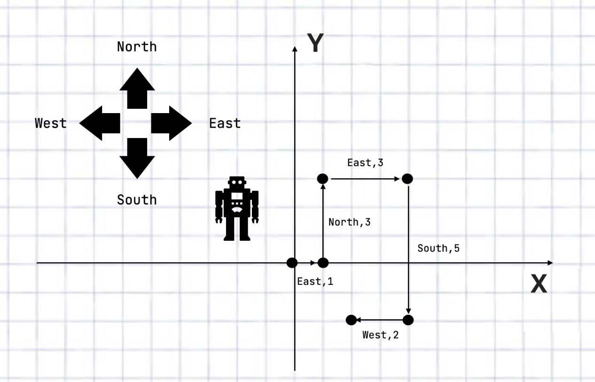

### Operating a robot

We are operating a robot. The robot can move in four directions only: North, East, West, and South. Each move is specified as a direction and a number of steps.



### The task

Using the Spring Boot framework, implement a service that:

1. Receives a list of movement operations in JSON format as an input and outputs the coordinates recorded after each move as a JSON document. Assume that the initial location for the robot is always at (0, 0).

   Example of a curl command to test your implementation:
   
   ```bash
   curl --header "Content-Type: application/json" \
   --request POST \
   --data '[{"direction":"EAST","steps":1},{"direction":"NORTH","steps":3},{"direction":"EAST","steps":3},
            {"direction":"SOUTH","steps":5},{"direction":"WEST","steps":2}]' \
   http://localhost:8080/locations
   ```
   
   Result:
   ```json
   [{"x":0,"y":0},{"x":1,"y":0},{"x":1,"y":3},{"x":4,"y":3},{"x":4,"y":-2},{"x":2,"y":-2}]
   ```

2. Receives a list of locations and outputs a list of robot moves to visit all locations. Assume that the starting location of the robot is the first in the input list.

   Example of a curl command to test your implementation:
   
   ```bash
   curl --header "Content-Type: application/json" \
     --request POST \
     --data '[{"x": 0, "y": 0}, {"x": 1, "y": 0}, {"x": 1, "y": 3}, {"x": 0, "y": 3}, {"x": 0, "y": 0}]' \
     http://localhost:8080/moves
   ```
   
   Result:
   ```json
   [{"direction":"EAST","steps":1},{"direction":"NORTH","steps":3},{"direction":"WEST","steps":1},{"direction":"SOUTH","steps":3}]
   ```

* *Optional*: Find the shortest path through all of the locations provided as an input.
* *Note*: For testing you could also use commands from [requests.http](requests.http)

#### Additional requirements for both parts of the assignment

For each request, the application should store the input data and the corresponding result in a database. You can use any framework and database to implement the service.
